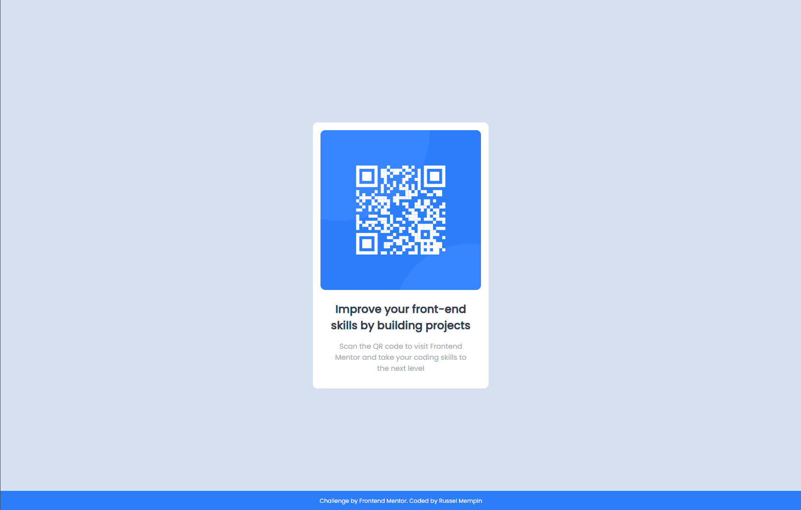

# Frontend Mentor - QR code component solution

This is a solution to the [QR code component challenge on Frontend Mentor](https://www.frontendmentor.io/challenges/qr-code-component-iux_sIO_H). Frontend Mentor challenges help you improve your coding skills by building realistic projects. 

## Table of contents

- [Overview](#overview)
  - [Screenshot](#screenshot)
  - [Links](#links)
- [My process](#my-process)
  - [Built with](#built-with)
  - [What I learned](#what-i-learned)
  - [Continued development](#continued-development)
  - [Useful resources](#useful-resources)
- [Author](#author)

## Overview

### Screenshot



### Links

- Solution URL: [https://www.frontendmentor.io/solutions/responsive-qr-code-but-the-transition-from-mobile-to-web-is-noticeable-o01xUm4ms9]https://www.frontendmentor.io/solutions/responsive-qr-code-but-the-transition-from-mobile-to-web-is-noticeable-o01xUm4ms9)
- Live Site URL: [https://russel-mempin.github.io/QR-Code-Component/](https://russel-mempin.github.io/QR-Code-Component/)

## My process

### Built with

- Semantic HTML5 markup
- CSS custom properties
- Flexbox
- Mobile-first workflow


### What I learned

```css
body {
  background-color: #d5e1ef;
  font-family: 'Poppins', sans-serif;
  margin: 0;
  padding: 0;
  min-height: 100vh;
  display: flex;
}

footer {
  background-color: #2c7dfa;
  color: #FFFFFF;
  position: fixed;
  bottom: 0;
  font-size: 12px;
  width: 100%;
  text-align: center;
}
```

The CSS with the body is a new thing I have learned from somewhere. I used it to vertically and horizontally align the qr code element. The footer css is used to fix the footer at the bottom of the screen. Since the body is a flexbox, they are still displayed beside each other. So I used the position: fixed and bottom: 0 to position the footer at the bottom of the browser and when I did that, the footer's width is still the same like it still is beside the qr code. So I put it's own width value to make it take up the space since I can't use flex: 1 or flex-basis.

### Continued development

I think I could have done a more optimal way with the footer since I am not comfortable using position with flex but I don't know what it could be replaced with yet. I also don't know yet how to make the transition from web to mobile unnoticeable since when I resize the window, the qr code 

### Useful resources

- [Make footer stick to the bottom of the page](https://dev.to/nehalahmadkhan/how-to-make-footer-stick-to-bottom-of-web-page-3i14) - This is where I got how to make the footer stick to the bottom. The comments section was useful because I got to read many other ways to do it.
- [CSS Flexbox Guide](https://css-tricks.com/snippets/css/a-guide-to-flexbox/) - I comeback to this website every now and then when I am using flex since sometimes I forget what I need if it is justify-content or align-items.
- [Flexbox Tutorial (CSS): Real Layout Examples] (https://www.youtube.com/watch?v=k32voqQhODc&list=PLLkgya-jWDwL7fIGmK3-LjZTDWYtFvxV5&index=2) - This is where I learned flexbox. The examples and explanations are easy to understand. 


## Author

- Frontend Mentor - [@russel-mempin](https://www.frontendmentor.io/profile/russel-mempin)

**Note: Delete this note and add/remove/edit lines above based on what links you'd like to share.**
